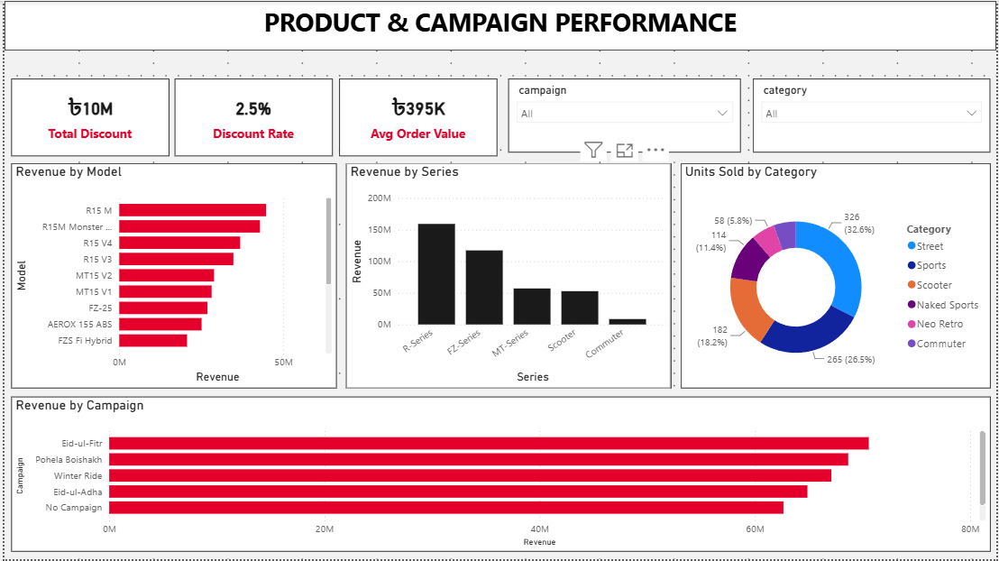

# 🏍️ Yamaha Bangladesh Sales Performance Analysis

## 📊 Project Overview

This project analyzes Yamaha Bangladesh motorcycle sales performance using **MySQL and Microsoft Power BI**.

The goal of the project is to demonstrate an end-to-end business intelligence workflow: organizing sales data in a relational database, connecting the database to Power BI, creating business measures, and developing an interactive dashboard for sales performance analysis.

---

## 🛠️ Tools & Technologies

- MySQL
- MySQL Workbench
- Microsoft Power BI
- SQL
- DAX
- Data Modeling
- Data Visualization

---

## 📈 Dashboard KPIs

The dashboard tracks key business metrics including:

- **Total Gross Revenue:** 404.65M BDT
- **Total Net Revenue:** 394.67M BDT
- **Total Units Sold:** 1,000
- **Unique Customers:** 939
- **Total Discount:** 9.98M BDT

---

## 🔍 Analysis Included

The dashboard provides analysis of:

- Revenue by motorcycle model
- Revenue by geographic division
- Revenue by marketing campaign
- Revenue by payment method
- Monthly sales and revenue trends
- Customer and unit sales performance
- Discount performance
- Interactive filtering by division, category, and campaign

---

## 🗄️ Data Workflow

The project follows this BI workflow:

**Sales Data → MySQL Database → SQL/Data Modeling → Power BI → DAX Measures → Interactive Dashboard**

The sales dataset was stored and managed in a MySQL database and connected directly to Power BI for analysis and visualization.

---

## 📐 DAX Measures

Key measures created for the dashboard include:

- Total Gross Revenue
- Total Net Revenue
- Total Units Sold
- Unique Customers
- Total Discount
- Discount Rate

These measures allow the dashboard to dynamically respond to filters and provide business-level performance indicators.

---

## 💡 Business Insights

The dashboard helps identify:

- Revenue differences across Bangladesh divisions
- Higher-performing motorcycle models
- Contribution of different payment methods to revenue
- Effectiveness of marketing campaigns
- Monthly changes in sales performance
- Overall discount impact on gross versus net revenue

---

## 🎯 Skills Demonstrated

This project demonstrates practical experience with:

**SQL | MySQL | Power BI | DAX | Data Modeling | KPI Development | Data Visualization | Sales Analytics | Business Intelligence**

---

## 📁 Repository Structure

The repository contains the Power BI Project (PBIP) files, including:

- Power BI report definitions and visual configurations
- Semantic model
- DAX measures
- Data model definitions
- Power BI project file

---

## 👤 Author

**Jeba Fariha**

Business Intelligence / Data Analytics Portfolio Project
